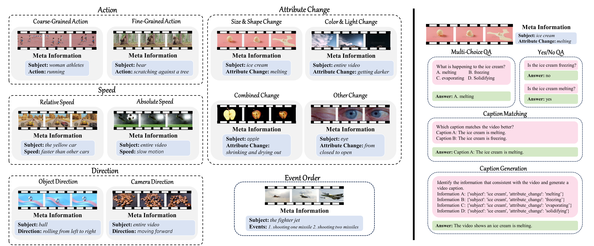
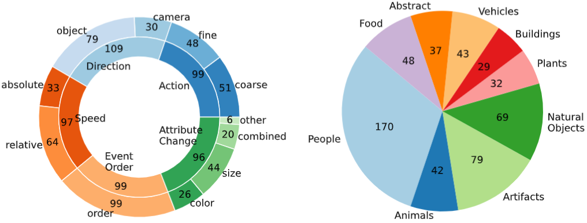
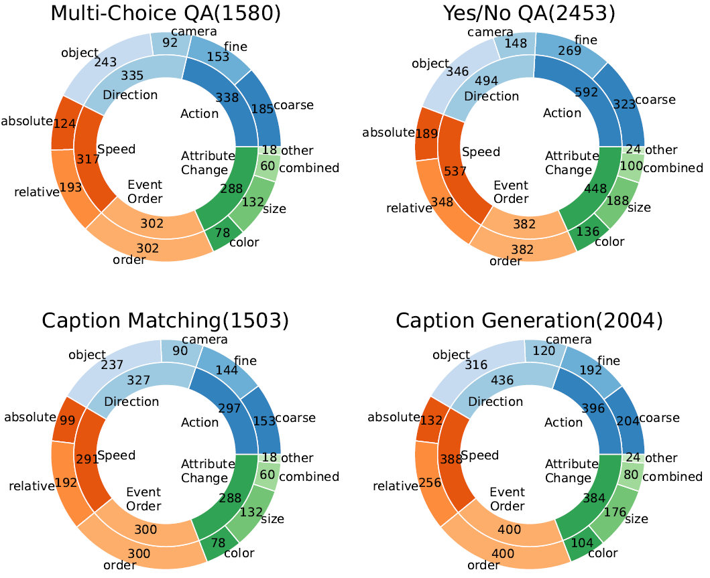
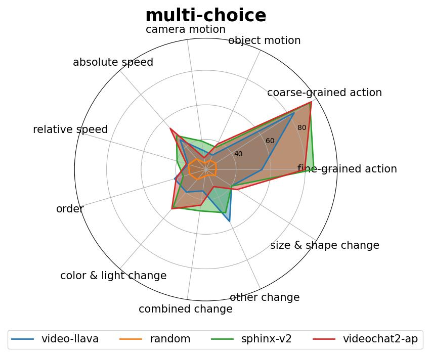
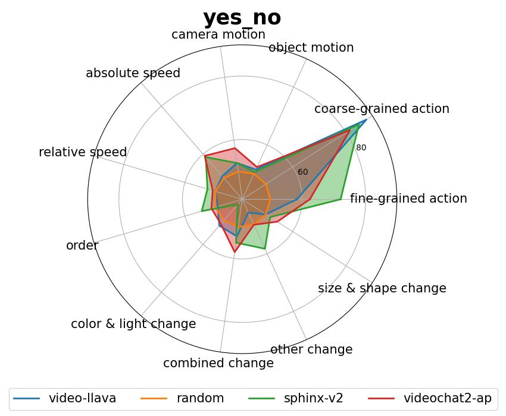
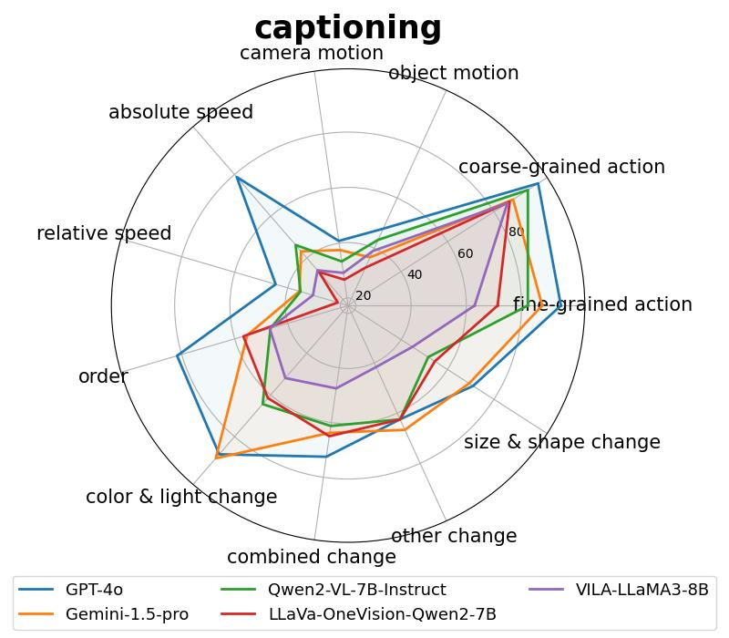

# TempCompass: A benchmark to evaluate the temporal perception ability of Video LLMs
<div align="center">
    <a href='https://arxiv.org/abs/2403.00476'></a>
</div>

<div>
<div align="center">
    <a href='https://llyx97.github.io/' target='_blank'>Yuanxin Liu<sup>1</sup></a>&emsp;
    <a href='https://lscpku.github.io/' target='_blank'>Shicheng Li<sup>1</sup></a>&emsp;
    <a href='https://liuyi-pku.github.io/' target='_blank'>Yi Liu<sup>1</sup></a>&emsp;
    Yuxiang Wang<sup>1</sup>&emsp;
    <a href='https://renshuhuai-andy.github.io/' target='_blank'>Shuhuai Ren<sup>1</sup></a>&emsp;
    </br>
    <a href='https://lilei-nlp.github.io/' target='_blank'>Lei Li<sup>2</sup></a>&emsp;
    <a href='https://pkucss.github.io/' target='_blank'>Sishuo Chen<sup>1</sup></a>&emsp;
    <a href='https://xusun26.github.io/' target='_blank'>Xu Sun<sup>1</sup></a>&emsp;
    <a href='https://houlu369.github.io/' target='_blank'>Lu Hou<sup>3</sup></a>
</div>
<div>
<div align="center">
    <sup>1</sup>Peking University&emsp;
    <sup>2</sup>The University of Hong Kong&emsp;
    <sup>3</sup>Huawei Noah’s Ark Lab
</div>

## Overview

TempCompass encompasses a diverse set of temporal aspects (left) and task formats (right) to comprehensively evaluate the temporal perception capability of Video LLMs.

## Data Preparation
**1. Task Instructions**

The task instructions can be found in `questions/`.

**2. Videos**

Run the following commands. The videos will be saved to `videos/`.
```
cd utils
python download_video.py    # Download raw videos
python process_videos.py    # Construct conflicting videos
```

## Run Inference
We use [Video-LLaVA](https://github.com/PKU-YuanGroup/Video-LLaVA) as an example to illustrate how to conduct MLLM inference on our benchmark.

Run the following commands. The prediction results will be saved to `predictions/video-llava/`.
```
cd run_video_llava
python inference_dataset.py
```

## Run Evaluation

## Data Statistics
### Distribution of Videos


### Distribution of Task Instructions


## Evaluation Results
The following figures present results of [Video LLaVA](https://github.com/PKU-YuanGroup/Video-LLaVA), [VideoChat2](https://github.com/OpenGVLab/Ask-Anything/tree/main/video_chat2), [SPHINX-v2](https://github.com/Alpha-VLLM/LLaMA2-Accessory/tree/main/SPHINX) and the random baseline. Results of more Video LLMs and Image LLMs can be found in our [paper](https://arxiv.org/abs/2403.00476).






## TODOs
- [x] Upload scripts to collect and process videos.
- [ ] Upload the code for task instruction generation.
- [ ] Upload the code for automatic evaluation.

## Citation
```bibtex
@article{liu2024tempcompass,
  title   = {TempCompass: Do Video LLMs Really Understand Videos?},
  author  = {Yuanxin Liu and Shicheng Li and Yi Liu and Yuxiang Wang and Shuhuai Ren and Lei Li and Sishuo Chen and Xu Sun and Lu Hou},
  year    = {2024},
  journal = {arXiv preprint arXiv: 2403.00476}
}
```
